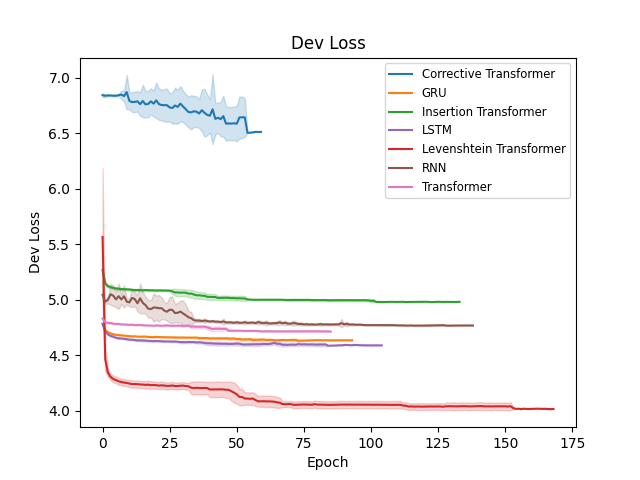

# Transformers 2 Electric Boogaloo

A benchmarking suite for our new model the ***The Corrective Transformer***, by comparison to the Levenshtein Transformer, Insertion Transformer, Vanilla Transformer, GRU, LSTM, RNN.

## Features

- Configurable via YAML under `configs/`
- Multiple architectures: RNN, LSTM, GRU, Transformer, Insertion/Levenshtein/Correction Transformer
- Training & eval runners under `src/runner.py`
- Built-in logging: console, TensorBoard, MLflow, or Weights & Biases
- Unification of metrics: loss, perplexity, BLEU, ROUGE
- Batch-submission scripts in `jobs/`

## Install

```bash
# install the uv package manager
curl -LsSf https://astral.sh/uv/install.sh | sh

# build your python venv
uv sync

# run an job
uv run srcs/main.py
```

## Directory Structure
```
transformers_2_electric_boogaloo/
├─ configs/
│  ├─ config.yaml            # general settings & profiles
│  └─ models/*.yaml          # model-specific hyperparams
├─ src/
│  ├─ main.py                # entry point: `uv run src/main.py`
│  ├─ runner.py              # Language/Levenshtein/Insertion/Correction runners
│  ├─ utils.py               # loss, BLEU/ROUGE helpers
│  ├─ viz.py                 # sample generation
│  └─ logger.py              # logging wrappers
├─ jobs/                     # Condor/SLURM experiment scripts
│  ├─ run.sh
│  └─ run.job
└─ plot_results.py           # aggregate & plot metrics from `logs/`
```
# Getting Started

## Configuration of Experiments

Edit `configs/config.yaml` to change the hyperparameters of each experiment.

```yaml
bs: 10
epochs: 100_000 # just go until patience exceeded
?debug: false  # tip: use "--debug" on the command line to set this
sample_temperature: 0.8
corruption_prob: 0.15
patience: 20
eval_samples: 5
```

- bs, epochs, patience, corruption_prob under configs/config.yaml
-Per-model overrides in configs/models/*.yaml
-Change dataset file or tokenizer in configs/config.yaml: dataset
## Launch an experiment

To deploy a job with its "run name" being "transformer_sweep" and it to use the transformer architecture, you would specify it on the command line as such:
`uv run src/main.py --profiles transformer --run_name transformer_sweep`

You can monitor the logs of this experiment in `<your CWD>/logs/<run_name>/metrics.csv` or via your logging platform of your choice.

To aggregate results and plot across sweeps you will call `uv run plot_results.py --logs_root logs --save_dir figs/`



## Deployment of Experiments

To deploy a full experiment set simply SSH to one of the WWU lab machines and run `./jobs/experiment.sh`.
This will deploy a bunch of Condor HTC jobs to run a bunch of individual experiments from which we can examine the results of after.

To ensure that your jobs are being run correctly, you can run the command `condor_q` to check the status of all of your jobs, you will likely see something like:

```
❯ condor_q
-- Schedd: csci-lab-head.cs.wwu.edu : <140.160.143.132:9618?... @ 06/10/25 12:13:47
OWNER   BATCH_NAME          SUBMITTED   DONE   RUN    IDLE  TOTAL JOB_IDS
fettigj transformer        6/7  00:07      8      2      1     20 6709.5 ... 6731.1
fettigj ins_transformer    6/7  00:07      8      1      1     20 6713.7 ... 6735.0
fettigj lev_transformer    6/7  00:07      6      2      1     20 6714.6 ... 6736.0
fettigj corr_transformer   6/7  00:07      6      2      1     20 6715.2 ... 6737.0
fettigj gru                6/10 12:13      _      1      1     10 6732.0-1
fettigj lstm               6/10 12:13      _      1      1     10 6733.0-1
fettigj rnn                6/10 12:13      _      1      1     10 6734.0-1

Total for query: 17 jobs; 0 completed, 0 removed, 7 idle, 10 running, 0 held, 0 suspended
Total for fettigj: 17 jobs; 0 completed, 0 removed, 7 idle, 10 running, 0 held, 0 suspended
Total for all users: 20 jobs; 0 completed, 0 removed, 8 idle, 11 running, 1 held, 0 suspended
```
